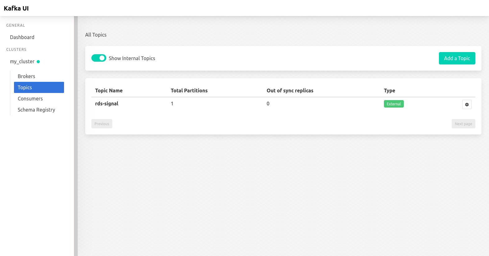

<h1 align="center">fmap (Frequence Mapper)</h1>
<p align="center">(🇮🇹) Monitora la qualità della ricezione dei segnali radio nelle province siciliane. </p>
<p align="center">(🇺🇸) Monitors the quality of radio signal reception in the Sicilian provinces. </p>


## ⚡ Quickstart

```shell
$ git clone (this repo)
$ cd fmap
$ docker-compose up -d
```


## 📊 Data flow 


### PI/frequence - Station Conversion maps

 Frequency - StationName (province) maps are stored in `fmdata` directory: 

| Province | URL                                                          |
| -------- | ------------------------------------------------------------ |
| Catania  | [Link to Catania csv](https://github.com/triglie/FMap-server/blob/main/scrapers/data/fm-station-map-catania.csv) |
| Messina  | [Link to Messina csv](https://github.com/triglie/FMap-server/blob/main/scrapers/data/fm-station-map-messina.csv) |
| Palermo  | [Link to Palermo csv](https://github.com/triglie/FMap-server/blob/main/scrapers/data/fm-station-map-palermo.csv) |

> Any other province outside of this three uses the csv of the nearest province. 

Frequency - PI - StationName map is stored in `fmdata` directory: 

| State    | URL                                                          |
| -------- | ------------------------------------------------------------ |
| Italia   | [Link to National FM map csv](https://github.com/triglie/FMap-server/blob/main/scrapers/data/complete-pi-station-map.csv) |


## Kafka UI 

To use Kafka UI, go to http://localhost:8080 




## Building kafkastream apps 

[...]


## Authors 

* [Luigi Seminara](https://github.com/Gigi-G)
* [Lemuel Puglisi](https://github.com/LemuelPuglisi) 

