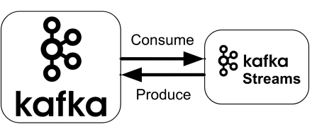
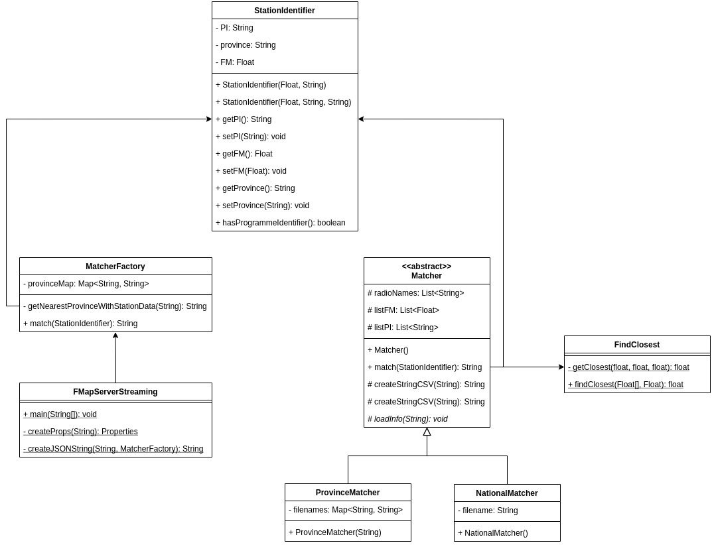
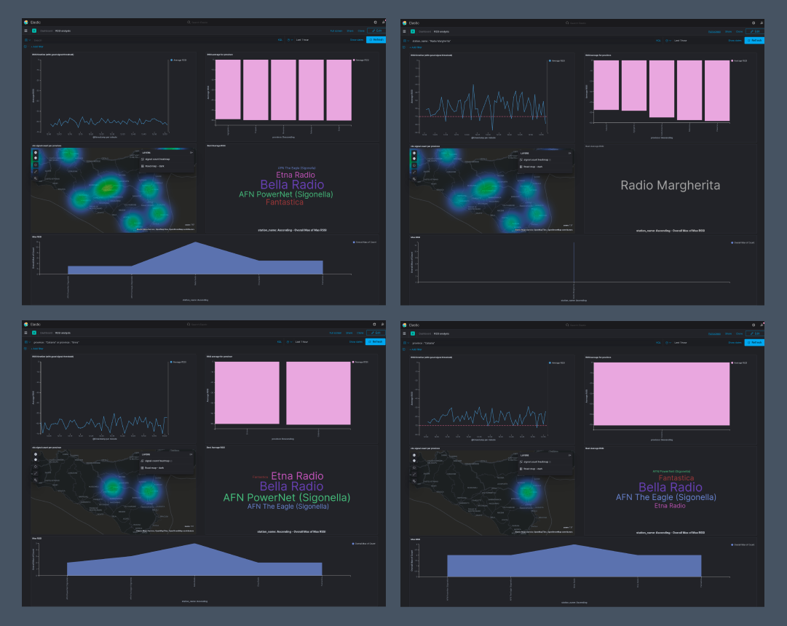

<h1 align="center">fmap (Frequence Mapper)</h1>
<p align="center">(🇮🇹) Monitora la qualità della ricezione dei segnali radio nelle province siciliane. </p>
<p align="center">(🇺🇸) Monitors the quality of radio signal reception in the Sicilian provinces. </p><br>


## ⚡ Quickstart

```shell
$ git clone https://github.com/triglie/fmap.git
$ cd fmap
$ docker-compose up -d
```


## 📊 Data flow 

<p align="center">
  
</p>


##  PI/frequence - Station Conversion maps

 Frequency - StationName (province) maps are stored in `fmdata` directory: 

| Province | File path                                                    |
| -------- | ------------------------------------------------------------ |
| Catania  | <a href="https://github.com/triglie/fmap/blob/main/kafkastream/fmdata/fm-station-map-catania.csv">kafkastream/fmdata/fm-station-map-catania.csv</a> |
| Messina  | <a href="https://github.com/triglie/fmap/blob/main/kafkastream/fmdata/fm-station-map-messina.csv">kafkastream/fmdata/fm-station-map-messina.csv</a> |
| Palermo  | <a href="https://github.com/triglie/fmap/blob/main/kafkastream/fmdata/fm-station-map-palermo.csv">kafkastream/fmdata/fm-station-map-palermo.csv</a> |

> Any other province outside of this three uses the csv of the nearest province. 

Frequency - PI - StationName map is stored in `fmdata` directory: 

| State  | File path                                                    |
| ------ | ------------------------------------------------------------ |
| Italia | <a href="https://github.com/triglie/fmap/blob/main/kafkastream/fmdata/complete-pi-station-map.csv">kafkastream/fmdata/complete-pi-station-map.csv</a> |


##  Arduino

<a href="https://github.com/triglie/fmap/tree/main/arduino">Click here.</a>


##  LogStash


### What is it?

*"Logstash is a free and open server-side data processing pipeline that  ingests data from a multitude of sources, transforms it, and then sends  it to your favorite "stash.""*


<p>
    
</p>


##  Kafka Streams

<p align="center">
    
</p>

### What is it?

*"Kafka Streams is a client library for building applications and  microservices, where the input and output data are stored in an Apache Kafka® cluster. It combines the simplicity of writing and  deploying standard Java and Scala applications on the client side with the benefits of Kafka’s server-side cluster technology."*


### UML Schema

<p align="center">
    
</p>


##  Dashboards (Kibana)


### What is it?

*"Kibana is an free and open frontend application that sits on top of the  Elastic Stack, providing search and data visualization capabilities for  data indexed in Elasticsearch. Commonly known as the charting tool for  the Elastic Stack (previously referred to as the ELK Stack after  Elasticsearch, Logstash, and Kibana), Kibana also acts as the user  interface for monitoring, managing, and securing an Elastic Stack  cluster — as well as the centralized hub for built-in solutions  developed on the Elastic Stack. Developed in 2013 from within the  Elasticsearch community, Kibana has grown to become the window into the  Elastic Stack itself, offering a portal for users and companies."*





## Useful links 

| Container     | URL                                             | Description                           |
| ------------- | ----------------------------------------------- | ------------------------------------- |
| kafkaserver   | http://localhost:8080                           | Open kafka UI to monitor kafka server |
| connect       | http://localhost:8083                           | Kafka Connect base URL                |
| connect       | http://localhost:8083/connectors                | Kafka Connect connectors list         |
| elasticsearch | http://localhost:9200/                          | ElasticSearch base URL                |
| elasticsearch | http://localhost:9200/rds-signal-output/_search | ElasticSearch index content           |
| kibana        | http://localhost:5601                           | Kibana base URL                       |


## Authors 

* [Luigi Seminara](https://github.com/Gigi-G)
* [Lemuel Puglisi](https://github.com/LemuelPuglisi) 