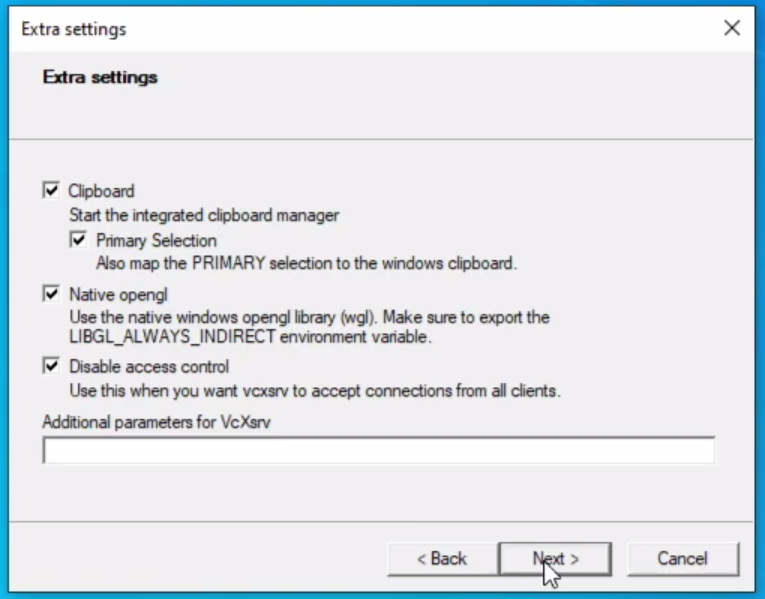
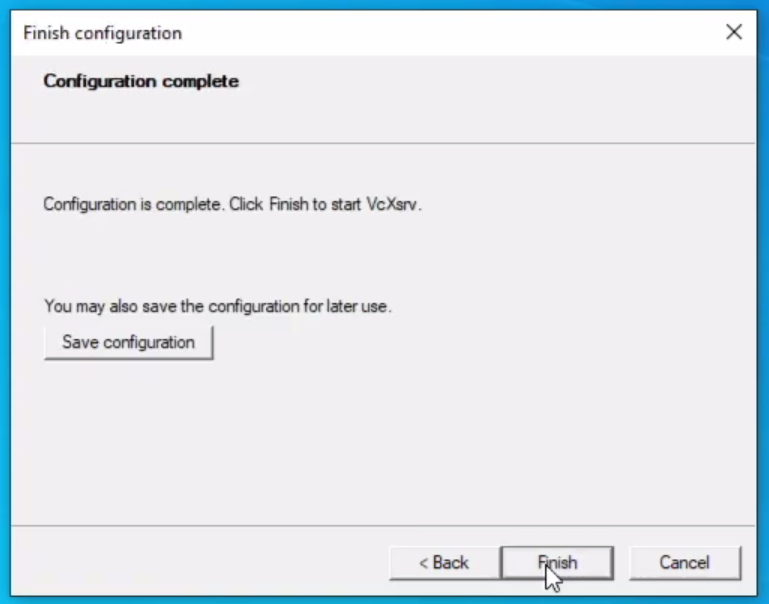
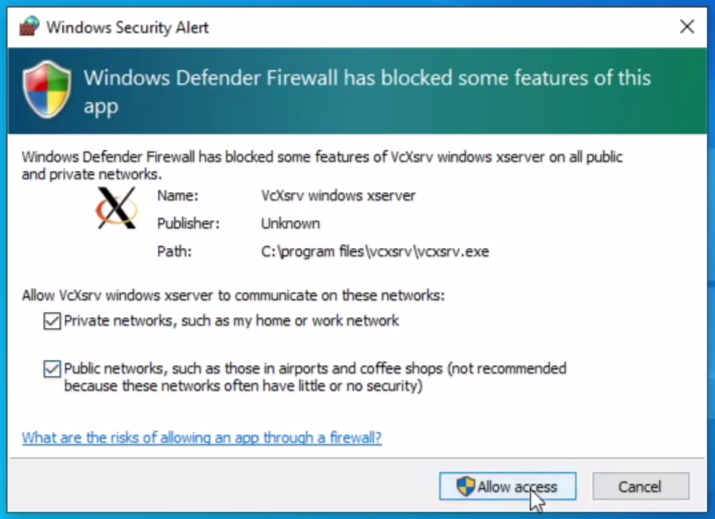
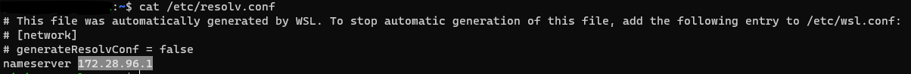

# Arduino FM receiver

In this repository you can find the Arduino FM receiver that is used to capture RDS package from FM frequencies and extracts information such as:

- Sender station;
- Program Identifier Code (PI Code);
- Text:
  - Messages;
  - Song name;
  - other information.

You can find all information about the library in this repository <a target = "_blank" href = "https://github.com/mathertel/Radio">https://github.com/mathertel/Radio</a> 

In order to use the information some changes have been made to the original library.


<p align="center">
    
</p>


## Wiring diagram

| *SI4703* | *Arduino Mega* |
| :------: | :------------: |
|   3.3V   |      3.3V      |
|   GND    |      GND       |
|   SDIO   |    SDA (20)    |
|   SCLK   |    SCL (21)    |
|   RST    |       52       |


## Usage

First of all you have to download the Arduino IDE tar.xz from this link: <a href="https://www.arduino.cc/en/software">https://www.arduino.cc/en/software</a> or using the following command:

```shell
$ wget https://downloads.arduino.cc/arduino-1.8.13-linux64.tar.xz
```

Move the `arduino-<version>` inside **/YouDontNeedSpotify/Arduino** and build the package using the following commands:

```shell
$ cd YouDontNeedSpotify/Arduino
$ docker build --tag youdontneedspotify:ArduinoRadio .
```

If you get an error you have to modify the Arduino IDE tar.xz inside the *Dockerfile*.

After that you have to go in **YouDontNeedSpotify/Arduino/bin**:

- *arduino-builder.sh* create a container called ArduinoBuilder, then you have to write the Arduino port and the sketch is uploaded into Arduino.
- *arduinoIDE.sh* create a container called ArduinoIDE that permits to use the IDE without any installation [NOT TESTED IN MAC].

**While using these scripts some errors and warnings will be shown, don't worry!**


After uploaded the code on Arduino, you can read from the serial interface using the following command:

```shell
python3 serial_reading.py
```


## On Windows (WSL)

**WARNING:** You can't use the scripts **YouDontNeedSpotify/Arduino/bin** because of WSL, so you have to wait future update. Well, the best solution for Windows is to use the official <a href="https://www.microsoft.com/it-it/p/arduino-ide/9nblggh4rsd8?ocid=badge&rtc=1&activetab=pivot:overviewtab" target="_blank">Arduino IDE</a>.

***If you want you can try the following steps.***

Download and install <a target="_blank" href="https://www.docker.com/products/docker-desktop">Docker Desktop</a>.

Download and install <a target="_blank" href="https://sourceforge.net/projects/vcxsrv/">VcXsrv</a>.

Now follow these steps:








Now use the following command:

```shell
$ cat /etc/resolv.conf
```

Take note of the nameserver.



After that, you have to use these command:

```shell
$ cd ~
$ nano .bashrc
```

At the end insert:

```shell
$ export DISPLAY=<nameserver>:0.0
$ export LIBGL_ALWAYS_INDIRECT=1
```

Use `CTRL+O` and `RETURN` to save; `CTRL+X` and `RETURN` to exit.

Then use:

```shell
$ source .bashrc
```


## Example

```bash
province=Catania coords=37.5013,15.0742 FM=87.50 RSSI=22 PI=5397
province=Catania coords=37.5013,15.0742 FM=87.60 RSSI=18 PI=0
province=Catania coords=37.5013,15.0742 FM=87.70 RSSI=6 PI=0
province=Catania coords=37.5013,15.0742 FM=87.80 RSSI=7 PI=0
province=Catania coords=37.5013,15.0742 FM=87.90 RSSI=6 PI=0
province=Catania coords=37.5013,15.0742 FM=88.00 RSSI=6 PI=0
province=Catania coords=37.5013,15.0742 FM=88.10 RSSI=14 PI=0
province=Catania coords=37.5013,15.0742 FM=88.20 RSSI=16 PI=0
province=Catania coords=37.5013,15.0742 FM=88.30 RSSI=14 PI=0
province=Catania coords=37.5013,15.0742 FM=88.40 RSSI=7 PI=0
province=Catania coords=37.5013,15.0742 FM=88.50 RSSI=8 PI=0
province=Catania coords=37.5013,15.0742 FM=88.60 RSSI=4 PI=0
province=Catania coords=37.5013,15.0742 FM=88.70 RSSI=12 PI=0
province=Catania coords=37.5013,15.0742 FM=88.80 RSSI=14 PI=0
province=Catania coords=37.5013,15.0742 FM=88.90 RSSI=5 PI=0
province=Catania coords=37.5013,15.0742 FM=89.00 RSSI=9 PI=0
province=Catania coords=37.5013,15.0742 FM=89.10 RSSI=16 PI=5274
province=Catania coords=37.5013,15.0742 FM=89.20 RSSI=16 PI=0
province=Catania coords=37.5013,15.0742 FM=89.30 RSSI=15 PI=0
province=Catania coords=37.5013,15.0742 FM=89.40 RSSI=11 PI=0
province=Catania coords=37.5013,15.0742 FM=89.50 RSSI=11 PI=0
province=Catania coords=37.5013,15.0742 FM=89.60 RSSI=2 PI=0
province=Catania coords=37.5013,15.0742 FM=89.70 RSSI=7 PI=0
province=Catania coords=37.5013,15.0742 FM=89.80 RSSI=7 PI=0
province=Catania coords=37.5013,15.0742 FM=89.90 RSSI=6 PI=0
province=Catania coords=37.5013,15.0742 FM=90.00 RSSI=7 PI=0
province=Catania coords=37.5013,15.0742 FM=90.10 RSSI=8 PI=0
province=Catania coords=37.5013,15.0742 FM=90.20 RSSI=11 PI=0
province=Catania coords=37.5013,15.0742 FM=90.30 RSSI=16 PI=0
```

